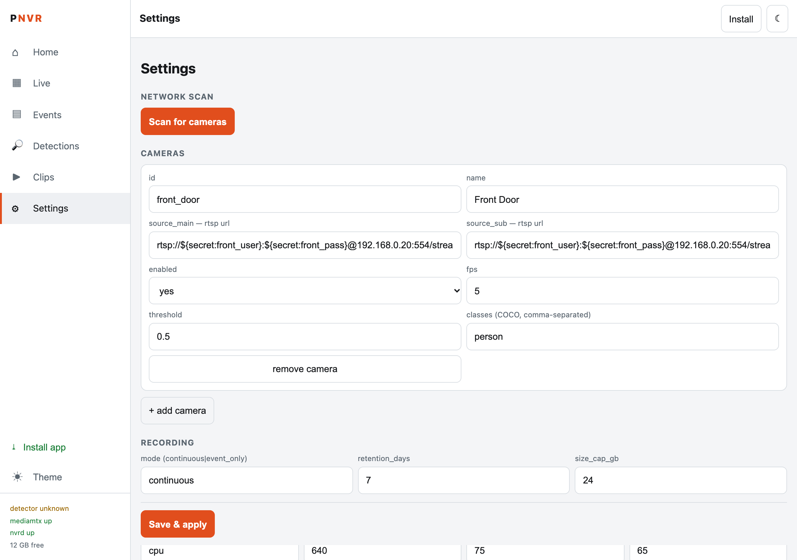

# PocketNVR

[](LICENSE)

Turn a spare rooted Android phone into a self-hosted NVR (network video recorder) appliance: continuous recording for IP cameras, **on-device AI person/object detection**, event snapshots and clips, push notifications, and an installable web UI — with no cloud dependency and no footage ever leaving your network.

It is **not an Android app**. It is a set of native arm64 Linux daemons that run as root on Android (via Magisk supervision): [MediaMTX](https://github.com/bluenviron/mediamtx) for RTSP ingest/recording/restreaming, a single static Go binary (`nvrd`) for the event store, notifications, REST API and web UI, and a C++ detector (`nvrdet`) using [NCNN](https://github.com/Tencent/ncnn) with a YOLO11n model.

<p align="center">
  
</p>

<p align="center"><em>The web UI (Settings page), served by the phone at <code>http://&lt;phone-ip&gt;:8099/</code>.</em></p>

## Features

- **Ingest & recording** — RTSP cameras via MediaMTX; continuous fMP4 segment recording with restreaming for live view and a proxied playback API for browsing the archive
- **On-device detection** — ffmpeg capture pipes from the camera sub-stream, motion pre-gating, YOLO11n inference (CPU fp16 by default, Vulkan optional), configurable detection zones and object classes (person, cat, dog, car)
- **Events** — SQLite event store, peak-frame snapshot with detection-box overlay, cropped object thumbnails, per-event MP4 clips
- **Notifications** — ntfy and/or Telegram with score thresholds, cooldowns, quiet hours, and a retry queue that replays undelivered events after restart
- **Web UI (PWA)** — installable from the browser; Home dashboard, Live view (WebRTC/WHEP with an HLS proxy fallback), Events, Detections grid, a Clips feed that plays event clips inline, and full Settings (camera add/edit, ONVIF/RTSP LAN discovery, secrets editor) — all hot-reloading, dark/light theme included
- **Appliance ops** — boot-time auto-start + watchdog with restart backoff, log rotation, retention by age/size/count, free-space guard that pauses recording before the disk fills, SoC thermal governor, wakelock, and a configurable charge-cap setting for 24/7 unattended duty
- **Security** — token auth on every API route, write-only secrets, redacted config reads; remote access via Tailscale or any TCP-only tunnel (the HLS proxy works where WebRTC UDP cannot)

## Architecture

```
 IP cameras ──RTSP──► MediaMTX ──────► recordings/ (fMP4 segments)
                        │
                        │ sub-stream (localhost RTSP)
                        ▼
                   ffmpeg pipes ──► nvrdet (C++ / NCNN)
                                    motion gate → YOLO11n → zones → event state machine
                                        │  events + snapshot/crop JPEG (HTTP ingest)
                                        ▼
 browser (PWA) ◄──── nvrd (Go, single static binary)
   • REST API + SSE event stream      • SQLite event store
   • notifications (ntfy/Telegram)    • clip extraction (stream-copy)
   • retention + free-space guard     • static web UI + HLS/WHEP/playback proxies
```

## Prerequisites

### The phone (the NVR itself)

PocketNVR runs native daemons as root, so the phone must be **rooted with Magisk**. Rooting wipes the device and can void the warranty, so use a spare phone, not your daily driver.

| Requirement | Details |
|---|---|
| CPU / OS | 64-bit ARM (arm64-v8a), Android 10 or newer |
| Root | **Magisk** installed and working (`su` available). The boot module is installed through Magisk. |
| Bootloader | Unlocked. This is normally needed to install Magisk. |
| Developer options | **USB debugging** enabled |
| Superuser for adb | In Magisk → Superuser, grant the **Shell** app root. `deploy.sh` stops with "su not elevated" if you skip this. |
| Storage | 32 GB or more. Recordings live in `/data/nvr/recordings`, so size `recording.size_cap_gb` to fit. |
| Power | Permanently plugged in. A 24/7 phone with a battery that is always at 100% swells over time, so also consider capping the charge. Pair it with a charge-limiting Magisk module such as ACC (see [step 7](#7-protect-the-battery-recommended-for-247)). |
| Network | Same LAN as your cameras. A static IP or DHCP reservation for the phone is recommended. |

Any recent mid-range phone works. The author's test device is a 2019-era Snapdragon phone (see [Performance](#performance)).

### Your cameras

Any IP camera or NVR that serves **RTSP**. You need each camera's RTSP URL, plus a username and password if it requires one. A **sub-stream** (low resolution) is strongly recommended: only the sub-stream is decoded for AI analysis, and the main stream is recorded untouched. Tapo, Dahua/CP Plus and Hikvision cameras all work this way. Enable RTSP or "camera account" in the camera's own app first.

### Your computer (the build host)

The phone runs pre-built binaries that you cross-compile and push over adb, so you need a computer on the same network as (or USB-attached to) the phone. macOS is what the project is developed on. Linux should work but is less tested.

| Tool | Used for | Install (macOS / Homebrew) |
|---|---|---|
| Go 1.25+ | `nvrd` daemon | `brew install go` |
| Android NDK r27+ | C++ detector | Android Studio → SDK Manager → NDK, or [download](https://developer.android.com/ndk/downloads) |
| CMake + git | detector and NCNN build | `brew install cmake git` |
| adb | pushing to the phone | `brew install android-platform-tools` |
| Python 3.10–3.12 | exporting the model | `brew install python@3.12` |
| curl, zip, ffmpeg | fetch scripts, boot module, tests | `brew install ffmpeg` (curl/zip ship with macOS) |
| Docker (optional) | `build_arm64.sh --docker` validation only | Docker Desktop |

## Getting started

Do this on your computer, from the repo root. Each step is a script in `scripts/`.

### 1. Prepare the phone

1. Root it with Magisk (see the [Magisk install guide](https://topjohnwu.github.io/Magisk/install.html) for your model).
2. Enable Developer options → **USB debugging**, plug the phone into your computer, and accept the RSA prompt on the phone.
3. Check adb sees it, then check root works:

   ```bash
   adb devices                     # should list your phone as "device"
   adb shell su -c id              # accept the Magisk prompt; expect uid=0(root)
   ```

   For a wireless connection, use Developer options → Wireless debugging, then `adb pair` and `adb connect`.

### 2. Fetch dependencies

```bash
scripts/fetch-mediamtx.sh        # MediaMTX RTSP server (linux/arm64 for the phone)
scripts/fetch-ffmpeg.sh          # static arm64 ffmpeg used by the detector
scripts/fetch_model.sh           # downloads YOLO11n and exports it to NCNN
```

`fetch_model.sh` creates a Python virtualenv in `models/.venv` and pulls in `ultralytics`, which is large (it includes PyTorch), so allow a few minutes. The model weights are AGPL-3.0 and are generated on your machine rather than shipped in this repo (see [License](#license)).

### 3. Build the detector

```bash
export ANDROID_NDK=~/Library/Android/ndk/android-ndk-r27c   # adjust to your NDK path
scripts/build_detector_android.sh
```

This clones NCNN, cross-compiles it for arm64 Android, then builds `nvrdet`. The first run takes a while. It writes `detector/build-android-ncnn/nvrdet`, which `deploy.sh` picks up automatically. If you skip this step, deployment still works but without AI detection (recording and live view only).

### 4. Deploy to the phone

```bash
scripts/deploy.sh --start
```

This builds `nvrd` for arm64, pushes everything to `/data/nvr` on the phone, and starts the daemons. On first install it generates a random API token on the device and prints it at the end (`api_token: …`). **Copy that token**, since you sign in with it. To see it again later:

```bash
adb shell su -c 'grep api_token /data/nvr/secrets.yaml'
```

### 5. Open the UI and add your cameras

Find the phone's IP address (Settings → About phone → Status, or `adb shell ip route`), then open `http://<phone-ip>:8099/` in a browser on the same network and sign in with the token. You can install it as an app from the browser menu ("Add to Home screen").

Then, in **Settings**:

1. Use **Discover** to scan the LAN for ONVIF/RTSP cameras, or add one by hand.
2. Enter each camera's main and sub-stream RTSP URLs.
3. Set the camera username and password in the **Secrets** editor. The shipped placeholders are `front_user`/`front_pass` and `back_user`/`back_pass`, with the value `changeme`.
4. Save. Changes hot-reload with no restart. Live view, events and clips appear in the other tabs.

The default `config/config.yaml` is only an example (two sample cameras at `192.168.0.20` and `.21`, the second disabled). You can also edit `/data/nvr/config.yaml` on the phone directly and run `adb shell su -c '/data/nvr/bin/nvrctl restart'`.

### 6. Make it survive reboots (Magisk boot module)

```bash
scripts/install_boot_module.sh            # add --reboot to prove it starts unattended
```

This packages `deploy/magisk-module/` into a flashable zip, pushes it to the phone and installs it with `magisk --install-module`. You can also install `dist/PocketNVR-boot.zip` yourself from the Magisk app (Modules → Install from storage). It shows up in the Magisk module list as **PocketNVR**; remove it there to stop the appliance starting at boot.

With `--reboot`, the script reboots the phone, waits for it to come back, waits another 45 seconds for the daemons, and prints `nvrctl status`. Run it once to prove your phone comes back on its own.

**What happens on every boot** (`deploy/magisk-module/service.sh`):

1. Clears stale PID and backoff files left by the previous run, so recycled PIDs can't make the supervisor think a daemon is already running.
2. Waits for Android's `boot_completed` (up to about 2 minutes).
3. Waits for a default network route (up to 2 minutes). If the network never appears it starts anyway, and the daemons keep retrying their cameras.
4. Takes a CPU wakelock (if `system.wakelock: true`), so Android doesn't doze the phone and stall recording.
5. Regenerates `mediamtx.yml` and `detector.json` from `config.yaml`, so a config change made from the UI always survives a reboot.
6. Starts MediaMTX, `nvrd` and the detector in order, then launches the watchdog.

**What the watchdog does while running** (`nvrctl watch`):

- Checks every daemon every 15 seconds and restarts any that died.
- Backs off exponentially between restarts (30 s up to 10 min), and resets once a daemon has stayed up for 5 minutes. A crash-looping daemon therefore can't hammer the phone.
- Rotates any log over 5 MB.

Notifications that couldn't be sent (for example while the network was down) are queued and replayed after a restart. Recordings resume automatically, but there is a gap in the footage while the phone is down.

Boot and watchdog logs are in `/data/nvr/logs/` (`supervisor.log`, `watchdog.log`). You can check on things any time with:

```bash
adb shell su -c '/data/nvr/bin/nvrctl status'
adb shell su -c 'tail -n 50 /data/nvr/logs/supervisor.log'
```

### 7. Protect the battery (recommended for 24/7)

A phone that sits at 100% on a charger all day can swell its battery within months. The usual fix is to hold the charge between roughly 60% and 70%. PocketNVR does **not** bundle or control this. It is done by a separate Magisk module, [ACC (Advanced Charging Controller)](https://github.com/VR-25/acc), which you install yourself:

1. Download the latest ACC zip from its [releases page](https://github.com/VR-25/acc/releases). Install it from the Magisk app (Modules → Install from storage), then reboot.
2. Set the pause and resume levels from a root shell, for example pause at 70% and resume at 60%:

   ```bash
   adb shell su -c 'acc 70 60'
   ```

3. Check it with `adb shell su -c 'acc -i'`. The setting persists across reboots.

ACC's charging-control support differs from phone to phone, so check its documentation and confirm on your model that charging really pauses at the limit. `system.charge_cap_pct` in `config.yaml` is validated (50–90) but is only a record of your intended cap. It does not drive ACC, so set the limits in ACC itself.

### Notifications (optional)

Put `ntfy_topic_url`, or `telegram_bot_token` and `telegram_chat_id`, into the Secrets editor, then enable the provider in Settings. For access from outside your home, use Tailscale, or the Cloudflare Tunnel setup in [deploy/cloudflare/](deploy/cloudflare/README.md). Never forward port 8099 to the internet.

### Troubleshooting

| Symptom | Fix |
|---|---|
| `no authorized device` | Re-plug USB, accept the RSA prompt, run `adb devices`. |
| `su not elevated` | Magisk → Superuser → grant **Shell**. |
| `run scripts/fetch-mediamtx.sh first` | Do step 2. |
| `(detector not built yet — skipping…)` | Do step 3, then re-run `deploy.sh --start`. |
| Camera shows offline | Test the RTSP URL in VLC from your computer first. Check credentials and that the camera is enabled. |
| Can't reach the UI | Phone and computer must be on the same network. Check `nvrctl status` and that nothing blocks port 8099. |
| Logs | `adb shell su -c '/data/nvr/bin/nvrctl logs'` |

## Configuration

`config/config.yaml` is the single source of truth (cameras, recording, events, detection, notifications, API bind). Secrets live in `config/secrets.yaml` (chmod 600, never committed) and are referenced as `${secret:key}`; special characters are percent-escaped automatically when interpolated into URLs. `nvrd -check` validates, and SIGHUP hot-reloads — an invalid config keeps the previous good state. The Settings page writes both files through validated endpoints and triggers the same reload.

```yaml
cameras:
  - id: front_door
    name: Front Door
    enabled: true
    main_url: rtsp://127.0.0.1:8554/front_door          # recorded stream (via MediaMTX)
    sub_url: rtsp://127.0.0.1:8554/front_door_sub       # analyzed stream
    source_main: rtsp://${secret:front_user}:${secret:front_pass}@192.168.1.10:554/stream1
    source_sub: rtsp://${secret:front_user}:${secret:front_pass}@192.168.1.10:554/stream2
    detect:
      fps: 5
      threshold: 0.5
      zones: []          # empty = whole frame
```

| Secret key | Purpose |
|---|---|
| `api_token` | **Required.** Auth for every `/api` route (`Authorization: Bearer`, `X-Api-Token`, or `?token=` for ``/deep links) |
| `mediamtx_viewer_pass` | MediaMTX viewer auth |
| `<camera>_user` / `<camera>_pass` | Per-camera RTSP credentials |
| `ntfy_topic_url`, `telegram_bot_token`, `telegram_chat_id` | Notification providers |

## API overview

All routes require the token (except the static app shell). Highlights:

| Endpoint | Purpose |
|---|---|
| `GET /api/health` | Component status, SoC temperature, free storage |
| `GET/PUT /api/config`, `POST /api/secrets` | Validated config + write-only secrets management |
| `POST /api/discover` | ONVIF WS-Discovery + RTSP sweep of the local subnet |
| `GET /api/cameras` | Camera roster with live-playback endpoints |
| `GET /api/events` | Query events by camera / time window / label |
| `GET /api/events/{id}/snapshot` · `/crop` · `/clip` | Event image assets and MP4 clip (Range-capable) |
| `GET /api/events/stream` | Server-sent events for live UI updates |
| `GET /api/live/hls/{camera}/…`, `POST /api/live/whep/{camera}` | Proxied HLS / WHEP signaling for live view |
| `GET /api/playback/{camera}/list` · `/api/playback/{camera}/get` | Recordings browser + fMP4 windows for the timeline scrubber (proxied from MediaMTX's playback server) |
| `GET /api/metrics` | Event counters + detector gauges (fps, queue, thermals) |

## Performance

Measured on a OnePlus 7 (SD855 / Adreno 640, Android 16), YOLO11n at 640×640, steady-state median of 60 runs: **CPU fp16 ≈ 88 ms/frame** vs **Vulkan (Adreno GPU) ≈ 343 ms/frame**. NCNN's ARM CPU kernels beat the mobile Vulkan path by about 3.9× on this class of hardware, so `backend: cpu` is the default. Vulkan stays one config flip away; INT8 or a smaller `input_size` may shift the balance. A thermal governor halves or pauses the analysis fps as the SoC approaches its temperature ceiling and ramps back down afterward.

Re-measure on your own phone in one command with `scripts/bench_phone.sh`.

## Operations

```bash
adb shell su -c '/data/nvr/bin/nvrctl status'    # also: start | stop | restart | logs | watch
```

Device layout after deploy:

```
/data/nvr/
  bin/{nvrd,mediamtx,nvrdet,nvrctl,ffmpeg}
  config.yaml, secrets.yaml (600)      # mediamtx.yml + detector.json are generated
  events.db  recordings/  snapshots/  clips/  logs/  run/
```

- **Boot & watchdog** — the Magisk module starts everything after reboot (well under a minute) and runs `nvrctl watch`: exponential-backoff restarts and 5 MB log caps.
- **Retention** — events pruned by age and count; recordings by age and size. DB rows and their files die together.
- **Free-space guard** — below the configured floor it prunes, then pauses continuous recording via MediaMTX hot-reload while keeping detection alive; health reports `degraded` until space recovers.
- **Power** — wakelock keeps the SoC awake; for always-plugged-in duty, pair it with a charge-limiting Magisk module such as ACC (not bundled) to keep the battery in a healthy band.

## Development

Everything that doesn't need the phone runs on a normal dev machine:

```bash
go test ./...                     # unit tests across all Go packages
scripts/smoke_local.sh            # config validation → mediamtx.yml → MediaMTX boots
scripts/build_arm64.sh --docker   # validate the exact phone artifact in an arm64 container
scripts/e2e_detector.sh           # full pipeline test: synthetic RTSP camera → detection → event → snapshot served
```

The detector is plain C++17 (CMake): Mac/desktop builds for development, an NDK (bionic) build for the device. The e2e script publishes a looping synthetic camera over RTSP and asserts that events land in the store with valid JPEG assets.

## Security notes

- The app shell is served unauthenticated so the PWA login gate works; **every `/api/` route still requires the token**.
- Secrets are write-only: no API ever returns them, and `GET /api/config` returns field-path redacted `${secret:…}` placeholders that survive a config round-trip.
- Notification deep links embed the API token (required for `` assets); treat notification topics/chats as sensitive.
- Designed for trusted LANs / your own VPN. Don't expose port 8099 to the internet.
- Public HTTPS access without opening ports: [deploy/cloudflare/](deploy/cloudflare/README.md) fronts the UI with a Cloudflare Tunnel (outbound-only, the `tunnel` component in nvrctl) gated by Cloudflare Access; port 8099 itself stays LAN-only.

## Third-party

[MediaMTX](https://github.com/bluenviron/mediamtx) (MIT) · [NCNN](https://github.com/Tencent/ncnn) (BSD-3-Clause) · [YOLO11n](https://github.com/ultralytics/ultralytics) via PNNX export (AGPL-3.0 — applies to the model export pipeline) · FFmpeg (LGPL/GPL build config) · [stb_image_write](https://github.com/nothings/stb) (public domain) · [modernc.org/sqlite](https://pkg.go.dev/modernc.org/sqlite) (pure-Go SQLite).

## License

The code in this repository is released under the [MIT License](LICENSE).

The YOLO11n model weights are **not** included. Run `scripts/fetch_model.sh` to download and export them on your own machine. They come from Ultralytics and are licensed AGPL-3.0, which is separate from this repo's license; check those terms before distributing the weights or offering a service built on them.
